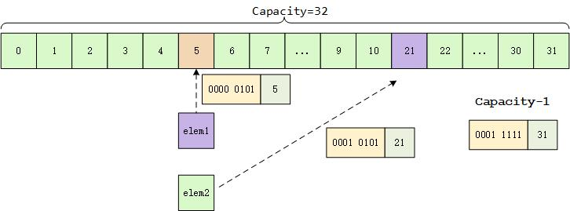
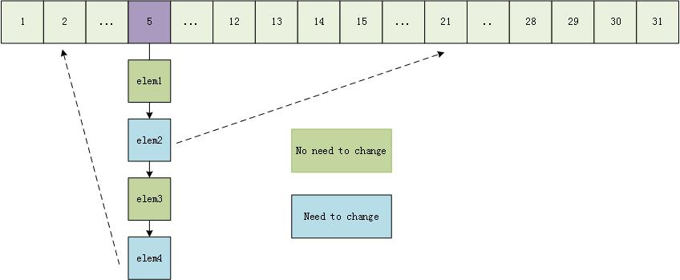
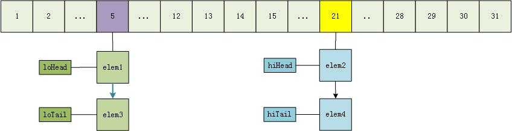

### 自己造的一些轮子

#### HashMap、LinkedHashMap

### hashMap 链表扩容机制

capacity = 16

capacity = 32

resize 前

resize 后

#### 参考文献:

1. [https://blog.csdn.net/mgl934973491/article/details/60466487](https://blog.csdn.net/mgl934973491/article/details/60466487)
2. [https://www.jianshu.com/p/8f0ef73b7ff4](https://www.jianshu.com/p/8f0ef73b7ff4)
